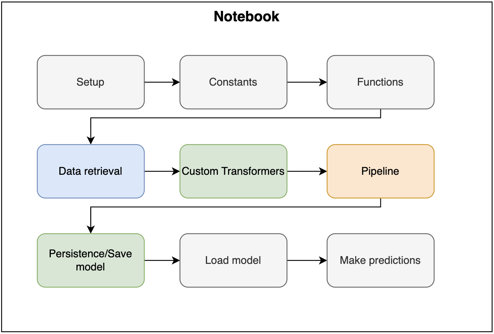
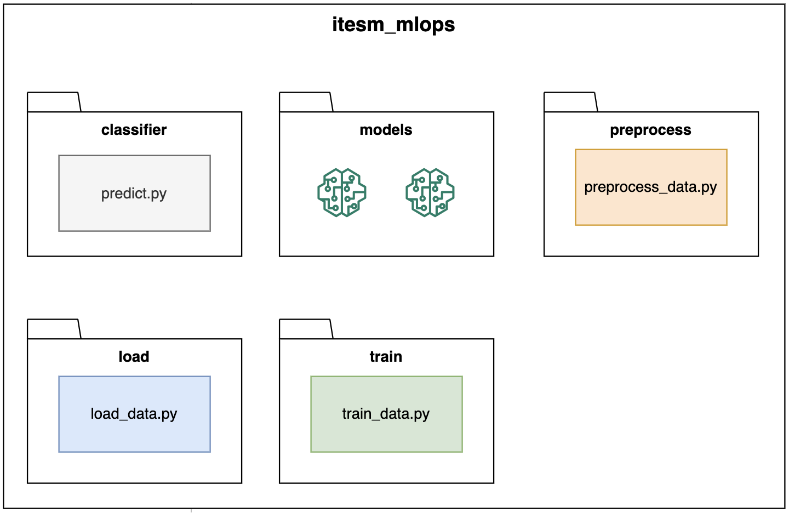
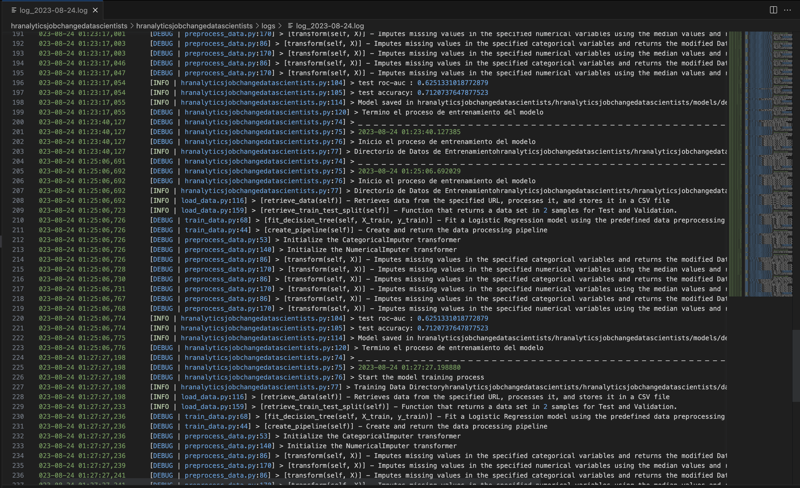
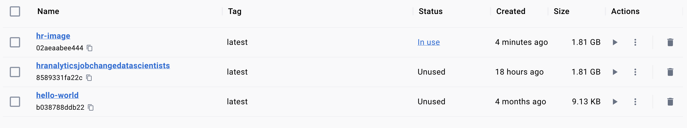
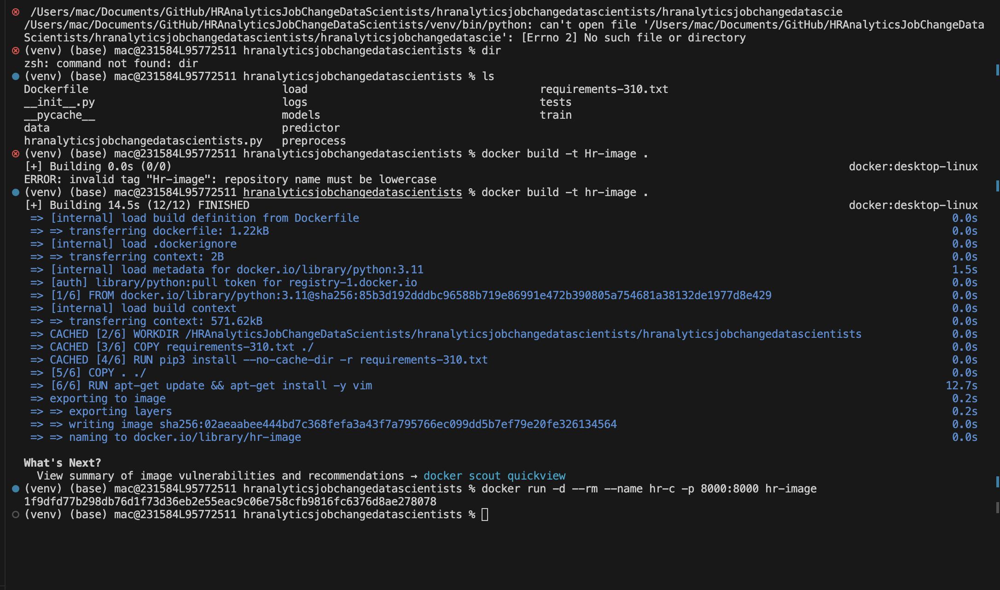
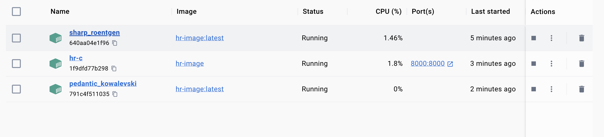

# HRAnalyticsJobChangeDataScientists
Creation of the Repository for the Integrator Project: HR Analytics: Job Change of Data Scientists - Predict who will move to a new job -


### Context

A company which is active in Big Data and Data Science wants to hire data scientists among people who successfully pass some courses which conduct by the company. Many people signup for their training. Company wants to know which of these candidates are really wants to work for the company after training or looking for a new employment because it helps to reduce the cost and time as well as the quality of training or planning the courses and categorization of candidates. Information related to demographics, education, experience are in hands from candidates signup and enrollment.

This dataset designed to understand the factors that lead a person to leave current job for HR researches too. By model(s) that uses the current credentials,demographics,experience data you will predict the probability of a candidate to look for a new job or will work for the company, as well as interpreting affected factors on employee decision.

The whole data divided to train and test . Target isn't included in test but the test target values data file is in hands for related tasks. A sample submission correspond to enrollee_id of test set provided too with columns : enrollee _id , target

Note:

- The dataset is imbalanced.

- Most features are categorical (Nominal, Ordinal, Binary), some with high cardinality.

- Missing imputation can be a part of your pipeline as well.

URL: https://www.kaggle.com/datasets/arashnic/hr-analytics-job-change-of-data-scientists?datasetId=1019790&language=Python&select=aug_train.csv

### Scope

With this project we seek to apply all the knowledge acquired in class, seeking to make an implementation of MLOps. Within the scope that we seek to apply is the following:

- Include virtual environments: Creation and implementation of an environment for Python.
- Continued use of GitHub: Continued use of Git with documented commits and incremental code.
- Unit tests: Generation of unit tests that allow to speed up the Test.
- Pre-commits: Generation of the Pre-commit process allowing alerts when rules of standards and good practices are not met
- Refactoring: Refactoring of a code to a folder structure, functionalities, classes and functions that allow to have a more reusable and scalable code.
- Linting and formatting: Automatic formatting through the use of Pre.commits that help to refactor code.
- Directory structure: Use of directory structures where we can have classes with main responsibilities.
- OOP (Classes, methods, transformers, pipelines): Use of object-oriented programming, and not code in a single notebook that cannot be reused and structured.


# Virtual Environments
Follow the instructions below to do the Environments.

### Instructions
1. Clone the project `https://github.com/germanamillano/HRAnalyticsJobChangeDataScientists` on your local computer.
2. Create a virtual environment with `Python 3.10.9`
    * Create venv
        ```
        python3.10 -m venv venv
        ```

    * Activate the virtual environment

        ```
        source venv/bin/activate
        ```

3. Install libraries
    Run the following command to install the other libraries.

    ```bash
    pip install -r '/Users/mac/Documents/GitHub/HRAnalyticsJobChangeDataScientists/requirements-310txt'
    ```
    Verify the installation with this command:
    ```bash
    pip freeze
    ```
    Output:

4. Install Pre-commit in Terminal
    ```
    pre-commit install   
    ```
    
3. Open the `hranalyticsjobchangedatascientists/hranalyticsjobchangedatascientists/hranalyticsjobchangedatascientists.py` notebook and click on `Run All`. 
    > **IMPORTANT!**  
    Do not forget to select the Python 3.10.9 kernel you have already created.

**Congrats, the notebook is running in a virtual environment with Python 3.10!**

## Continuous use of GitHub

* GitHub was used continuosly during the development of this project, increasing graduately the content of the repository.
  * [HRAnalyticsJobChangeDataScientists/commits](https://github.com/germanamillano/HRAnalyticsJobChangeDataScientists/commits/main)

# Pre-commits

* The Pre-commit functionality was implemented, within this functionality the following validations are being made:
  * isort
  * autoflake
  * autopep8
  * flake8
    * _Every one has its own hooks to represent specific checks on the code._
    * _The corresponding libraries are contained inside requirements-310.txt file. They may be installed but nothing will happen if .yaml file does not exist or is empty, or pre-commit has not been initialized on the project for the first time._
* The configuration file is: .pre-commit-config.yaml

### Install pre-commits

* Open your terminal, navigate to the root directory of your project
* Install pre.commitPre-commit for the firs time use:
    ```bash
    pip install pre-commit
    ```
* After creating the .pre-commit-config.yaml file, initialize pre-commit for the project:
  ```bash
  pre-commit install
  ```
* With the pre-commit hooks installed, you can now make changes to your Python code. When you're ready to commit your changes, run the following command to trigger the pre-commit checks:
  ```bash
  git commit -m "add pre-commit file"
  ```
* If every check "passed", then you are ready to upload your changes to the repository at GitHub.
  ```bash
  git push
  ```

# Cookiecutter

* Ensure you cover all the [prerrequisites](https://cookiecutter.readthedocs.io/en/stable/installation.html#prerequisites)
* Install cookiecutter

    ```bash
    python -m pip install cookiecutter
    ```

* Change the working directory to to hranalyticsjobchangedatascientists.

    ```bash
    cd hranalyticsjobchangedatascientists
    ```

    Otherwise, if you are working on a new project, just skip this step and go to the next one.
* Run this command, and fill out the information

## Directory structure

Once the template is created, it is time to create the folders with the code following this structure:

* Define the different sections of the notebook

* Create the following folders with the scripts in it:

    > **IMPORTANT!**  
    Create the `__init__.py` scripts on each folder where there are python scripts since they are important to mark the folder as a package, that will be imported later.
3. Migrate the notebook code to the scripts.

# Refactorization

* Folders with refactorized code is found in the following directory structure of this project.
  * api
  * docs
  * hranalyticsjobchangedatascientists
    * data
    * load
    * logs
    * models
    * predictor
    * preprocess
    * tests
    * train
  *

 * All the code separated in modules and classes can be executed in the terminal
   * Activate virtual environment
     ```bash
     source venv/bin/activate
     ```
   * After, run the following route:
     ```bash
     hranalyticsjobchangedatascientists\hranalyticsjobchangedatascientists.py
     ```

# Unit tests

* Unit tests are developed to acomplish basic validations on specific functionalities of the project.
  * Library: pytest
    * Add library pytest to file ```requirements-310.txt```
    * Install, move to project directory: ```pip install pytest``` or ```pip install -r requirements-310.txt```
  * Code folder: ```hranalyticsjobchangedatascientists/tests```
  * Run tests, terminal or console:
    * Run file: ```tests/unit_tests.py```
  * For tests parametrizable, Run file: ```tests/test_hranalyticsjobchangedatascientists.py```

# REST API

* The implementation of REST API was through the application of fastapi, pydantic and uvicorn libraries and the corresponding code can be found in the ```api/main.py``` folder of this project.
  * All libraries are included in ```requirements-310.txt``` file, and are already installed by this point.
* The endpoints generated to run the project as an API are:
  * healthcheck
  * train_new_model
  * predictor
* Run the following command to start House-pricing API locally.
  ```bash
  uvicorn hranalyticsjobchangedatascientists.api.main:app --reload 
  ```
* You can check the endpoints as follows:
  * Access ```http://127.0.0.1:8000/```, you will see a message like this ```"hr analytics job change decision tree is ready to go!"```.
  * Access ```http://127.0.0.1:8000/docs```, the browser will display the diferents endpoints


## Run FastAPI

* Run the next command to start the Titanic API locally

    ```bash
    uvicorn hranalyticsjobchangedatascientists.api.main:app --reload 
    ```

# Logs

* For check the log with info, debug and error you shoulg open the files in folder hranalyticsjobchangedatascientists\logs\log_[aaaa-mm-dd].log


    > **IMPORTANT!**  
    The Log have information like date, hour, file or class, log type, line in log and description.

# Docker

* Change the working directory to to hranalyticsjobchangedatascientists.

    ```bash
    cd hranalyticsjobchangedatascientists/hranalyticsjobchangedatascientists
    ```
* Run de next code on Terminal:
    ```bash
    docker build -t Hr-image .
    ```
* Next you can see the image created in Docker Desk

    

* After run the this code on Terminal:
    ```bash
    docker build -t hr- image
    ```

    
 
 * Now, we cat show in Docker the container:

    

* You can check the endpoints as follows:
  * Access ```http://localhost:8000/```
  